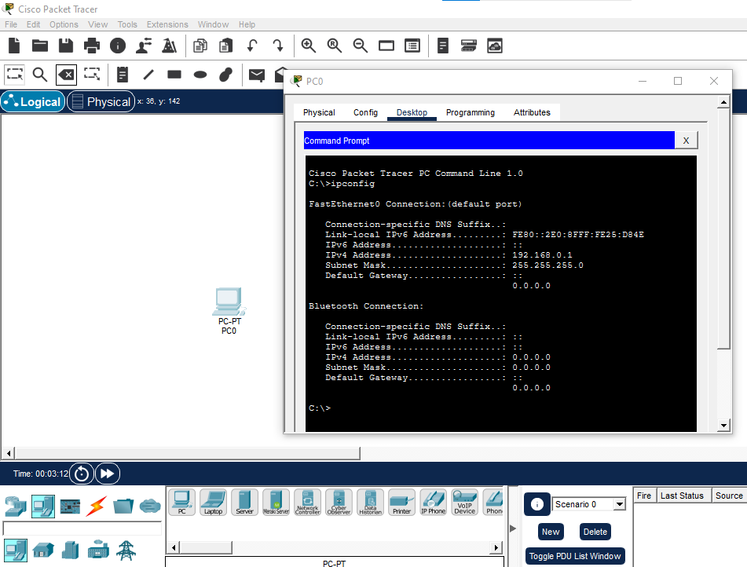
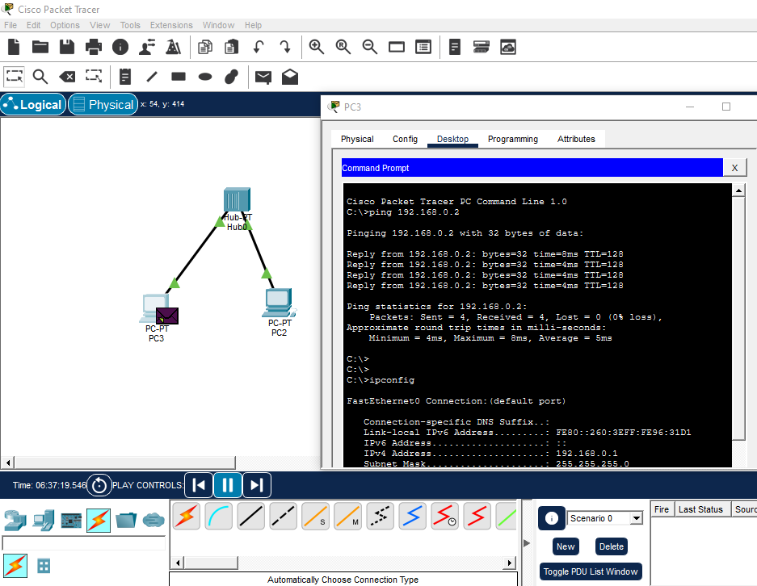

# 📡 Capítulo 1 – IP (Internet Protocol)

O **IP (Internet Protocol)** é um dos protocolos de rede mais importantes, responsável por **identificar dispositivos** e garantir que os pacotes de dados cheguem ao **destino correto**.

Ele funciona como um **endereço digital** para computadores, celulares, servidores e dispositivos de IoT.  

---

## 🌐 IPv4 e IPv6

- **IPv4 (Internet Protocol versão 4)**  
  - Usa **32 bits**, permitindo cerca de 4,3 bilhões de endereços.  
  - É a versão mais utilizada, mas com o aumento de dispositivos, há escassez de IPs.

- **IPv6 (Internet Protocol versão 6)**  
  - Usa **128 bits**, oferecendo aproximadamente 340 undecilhões de endereços.  
  - Mais seguro, eficiente e preparado para o futuro da internet.

---

## 🛠 Estrutura de um endereço IP

Um IP é dividido em duas partes:

1. **Parte da rede:** identifica a rede à qual o dispositivo pertence.  
2. **Parte do host:** identifica o dispositivo dentro da rede.

Exemplo IPv4:

- IP: `192.168.1.10`  
- Máscara: `255.255.255.0`  
- Em binário:  

IP: 11000000.10101000.00000001.00001010
Máscara:11111111.11111111.11111111.00000000

Neste caso:  
- **24 bits** para a rede  
- **8 bits** para os hosts

> 💡 Dica: visualize a máscara como uma régua que separa **rede** e **host**.

---

## 📦 Como o IP funciona

O IP transmite dados **divididos em pacotes**. Cada pacote contém:  

- Endereço IP do **remetente**  
- Endereço IP do **destinatário**  
- Número de sequência e informações de controle

Esses pacotes passam por **roteadores** até chegar ao destino, sendo **reagrupados na ordem correta**.

---

## 🖥️ Simulação no Cisco Packet Tracer

## 🖥️ Exemplos práticos

>  📌  **Observação:** A imagem mostra o IP atribuído ao dispositivo, a máscara de rede e o gateway padrão.

> 2️⃣ **Testando:** comunicação entre dispositivos na mesma rede (ping)

📌 Análise:

0% de perda de pacotes → comunicação bem-sucedida.

Tempo médio de 5ms, típico em rede local simulada.

Como está usando Hub, o tráfego é enviado para todos os dispositivos, mas só o destino responde.

ping google.com
tracert google.com
